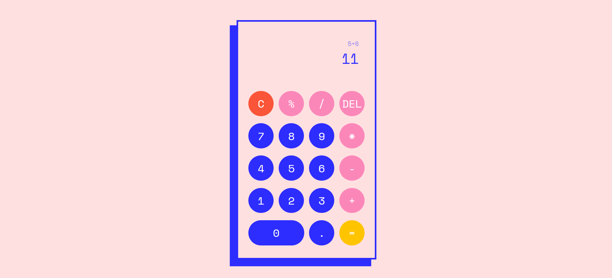

# Project Web Calculator

  

 

This calculator project is a product of day 32 of the 6-month web development boot camp I am taking and, simultaneously, day 7 of the introduction to Typescript. 
 
I am proud of my ability to find solutions and having programmed this calculator as a result. 🌈

## Table of Contents 📑

- [About](#about)
- [Tech Stack](#tech-stack)
- [Design](#design)

## About

I created this project as a participant of a boot camp for web development focusing on React and Typescript. It was developed over the course of a single day in Visual Studio Code using HTML, CSS and Typescript.

Made the day before New Year's eve, the goal of this project was to spend the time deepening an understanding of Typescript functions in the framework of the second module of the boot camp.

## Features
<ul>
  <li><b>Functions:</b>
  <ul>
    <li>Addition, subtraction, division, multiplication, modulo</li>
    <li>Clear all, delete last input</li>
    <li>Solve operation and continue calculating with result</li>
    <li>Display last operation above result</li>
  </ul>
  </li>
  <li><b>Responsive design:</b>
  <ul>
    <li>Optimised for different screens</li>
  </ul>
  </li>
</ul>

## Tech Stack

**Markup:**  
  
**Styling:**  
  
**Programming language:**  
  
**IDE:**  
  
**Version Control:**  
  

## Design

The playful, colourful design for this web calculator was inspired by both the flat, angular design of <a href="https://dribbble.com/shots/12909522--dailyui-Mortgage-Calculator" title="Sebastian Vigil - Mortgage Calculator">Sebastian Vigil's "Mortgage Calculator"</a>, as well as its vibrant blue, and the layout and colour assortment of <a href="https://dribbble.com/shots/15359416-MechaCalc-Calculator-App" title="Afrills - MechaCalc - Calculator App">Afrills' "MechaCalc - Calculator App"</a>. This combination makes for a modern look while 
ensuring a cohesive and visually appealing user experience.
